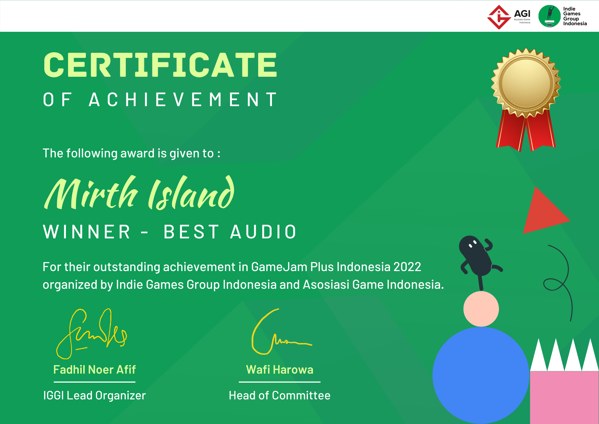
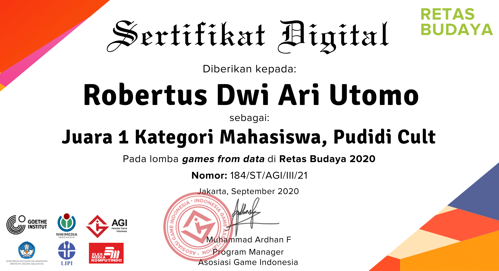
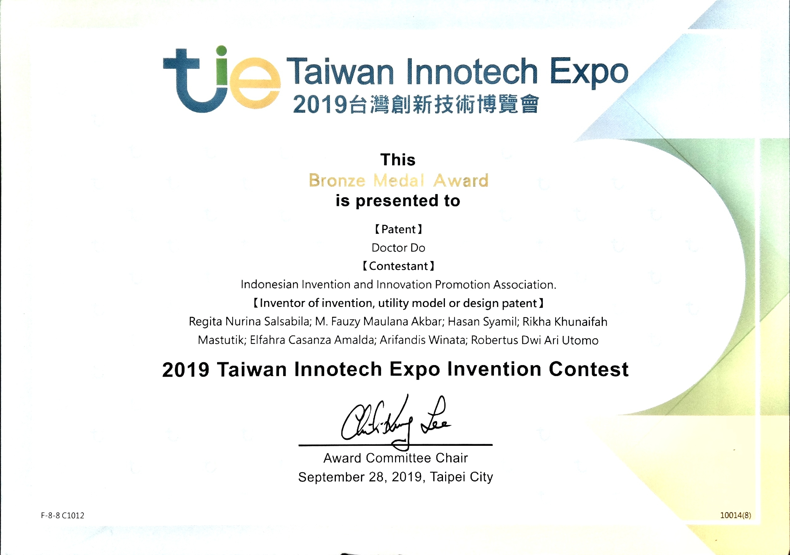
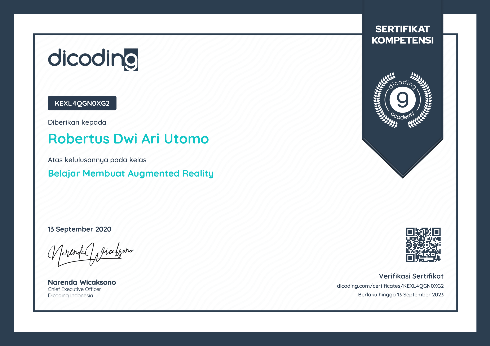
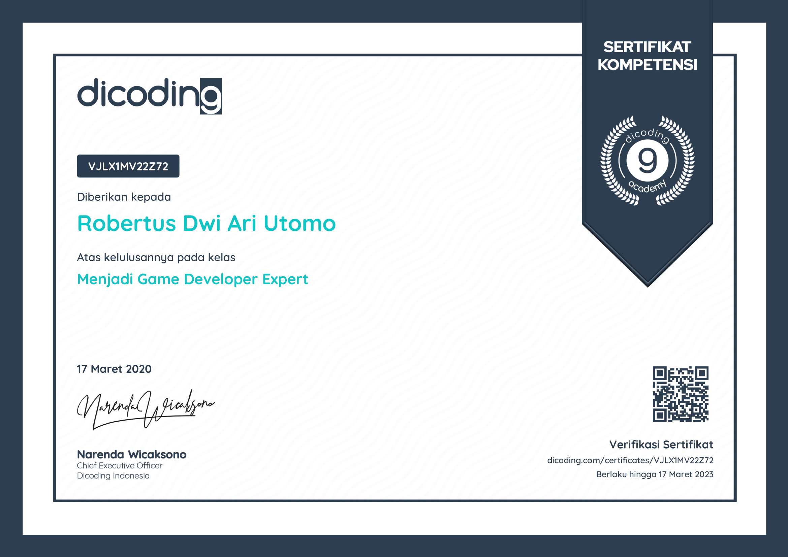

[Kembali](../)

# Sertifikat Kompetisi
* [Best Visual - Game Jam+ 2022](#best-visual-game-jam-plus-2022)
* [Best Audio - Game Jam+ 2022](#best-audio-game-jam-plus-2022)
* [Juara 1 - Retas Budaya 2020](#juara-1-retas-budaya-2020)
* [Bronze Medal - Taiwan Innotech Expo 2019](#bronze-medal-taiwan-innotech-expo-2019)

# Sertifikat Kursus
* [Dicoding - Membuat Augmented Reality](#dicoding-belajar-membuat-augemnted-reality)
* [Dicoding - Menjadi Game Developer Expert](#dicoding-menjadi-game-developer-expert)
* [Dicoding - Belajar Membuat Game untuk Pemula](#dicoding-belajar-membuat-game-untuk-pemula)

***

## Best Visual Game Jam Plus 2022

|					|															|
| ----------------- | --------------------------------------------------------- |
| Game				| [Mirth Island](../../game-project/#mirth-island)			|
| Acara				| [Game Jam+ 2022](../game-jam/#game-jam-plus-2022)			|
| Waktu				| November 2022												|
| Tipe				| **Lomba**													|

 

## Best Audio Game Jam Plus 2022

|					|															|
| ----------------- | --------------------------------------------------------- |
| Game				| [Mirth Island](../../game-project/#mirth-island)			|
| Acara				| [Game Jam+ 2022](../game-jam/#game-jam-plus-2022)			|
| Waktu				| November 2022												|
| Tipe				| **Lomba**													|

 

## Juara 1 Retas Budaya 2020

|					|															|
| ----------------- | --------------------------------------------------------- |
| Game				| [Arthiefactor](../../game-project/#arthiefactor)			|
| Acara				| [Games From Data - Retas Budaya 2020](https://www.agi.or.id/id/berita-terbaru/dua-game-terbaik-dari-games-from-data-game-jam-retas-budaya-2020)														  |
| Waktu				| Desember 2020												|
| Tipe				| **Lomba**													|

 

## Bronze Medal Taiwan Innotech Expo 2019

|					|															|
| ----------------- | --------------------------------------------------------- |
| Game				| [Doctor DO](../../game-project/#doctor-do)				|
| Acara				| **Taiwan Innotech Expo 2019**		   					    |
| Waktu				| September 2019											|
| Tipe				| **Lomba**													|

 

***
***

## Dicoding Belajar Membuat Augmented Reality

|					|															|
| ----------------- | --------------------------------------------------------- |
| Platform			| [Dicoding](https://www.dicoding.com/academies/135)		|
| Waktu				| September 2020											|
| Tipe				| **Kursus**												|

 

## Dicoding Menjadi Game Developer Expert

|					|															|
| ----------------- | --------------------------------------------------------- |
| Platform			| [Dicoding](https://www.dicoding.com/academies/47)			|
| Waktu				| Maret 2020												|
| Tipe				| **Kursus**												|

 

## Dicoding Belajar Membuat Game untuk Pemula

|					|															|
| ----------------- | --------------------------------------------------------- |
| Platform			| [Dicoding](https://www.dicoding.com/academies/58)			|
| Waktu				| Juli 2019													|
| Tipe				| **Kursus**												|

 