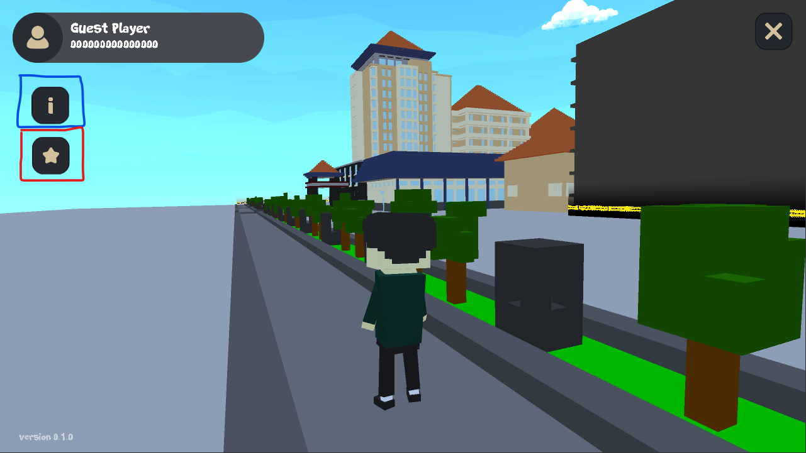
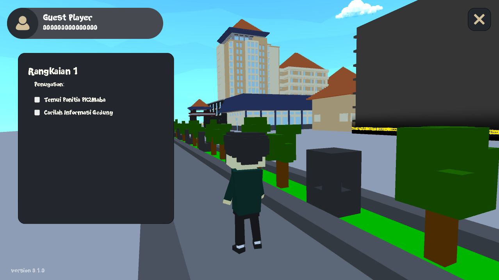
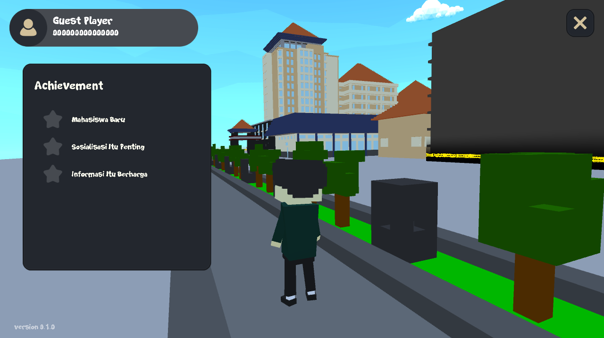
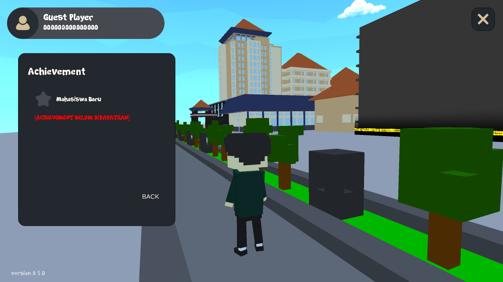

# Cara Memainkan FILKOM Virtual

> Visual UI bisa saja berubah seiring perubahan build versi. Tutorial Page telah disediakan pada gim mulai build versi 0.2.0

Langkah Bermain:
- [Login atau Bermain Sebagai Guest](#menu-utama)
- [Selesaikan Penugasan yang Diberikan](#penugasan)
- [Selesaikan Achievement yang Diberikan](#achievement)

[Note Penting](#note)

***

### Menu Utama

Pada menu awal anda akan dihadapkan dengan 2 tombol dengan keterangan sebagai berikut :
- Tombol Play as Guest adalah mode bermain publik yang tidak akan menyimpan data permainan namun pemain tetap dapat memainkan seluruh konten dalam gim
- Tombol Login adalah mode bermain dengan akun terdaftar dimana progres data dalam gim akan disimpan kedalam server sehingga pemain masih bisa melanjutkan permainan tanpa mengulang dari awal. 

***

### Penugasan

Daftar penugasan dapat dilihat pada tombol yang dikotak biru, daftar penugasan akan berbeda setiap rangkaian PK2Maba yang ada. Anda dapat menekan salah satu daftar penugasan untuk dapat melihat penugasan lebih detail. Selesaikan penugasan seperti yang diminta maka daftar akan berubah menjadi ceklis dan data akan disimpan apabila bermain sebagai pemain yang terdaftar (bukan bermain sebagai Guest).

***

### Achievement

Daftar achievement dapat dilihat pada kotak merah yang telah ditandai. Sama seperti penugasan, apabila salah satu daftar achievement ditekan maka akan ditampilkan informasi lebih lengkap dari achievement tersebut apabila sudah didapatkan.

***

### Note

Untuk mengetahui rangkaian apa yang saat ini aktif untuk dikerjakan penugasannya, dapat dilihat pada bagian penugasan. Pada bagian gambar yang dikotak merah merupakan informasi rangkaian yang saat ini sedang aktif. **(Percobaan 1 masih terdapat 1 rangkaian saja)**
